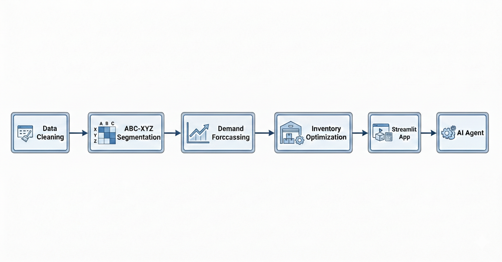
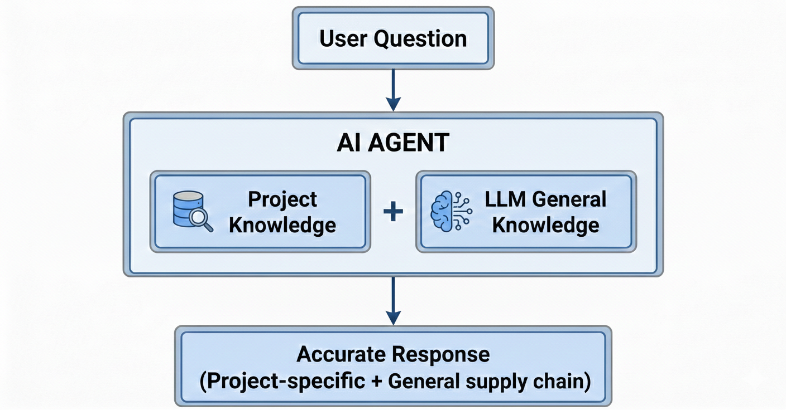

# 📊 Supply Chain Forecasting & Inventory Optimization with Gen AI Assistant

A data-driven approach to demand forecasting and inventory management for a global retail supply chain, powered by an AI assistant for interactive insights.


### 🛠️ Skills & Tools
`Python` `Pandas` `NumPy` `Matplotlib` `Plotly` `Streamlit` `Time Series Forecasting` `Inventory Management` `ABC-XYZ Analysis` `Gen AI` `LLM Integration` `OpenRouter API`

## 🛠️ Skills & Tools


🔗 **Live Demo:** [Forecasting-Inventory Optimization.app](https://forecasting-inventory-optimization-ai-agent.streamlit.app///)
---

## 📋 Business Case

### The Problem

*This project simulates a real-world scenario faced by many retail supply chains.*

A global retail company manages **87 products** across multiple markets. The supply chain team faces two critical challenges:

1. **Stockouts** — Lost sales due to insufficient inventory
2. **Overstocking** — Cash tied up in excess inventory

Currently, inventory decisions are based on intuition and historical averages, leading to inconsistent service levels and suboptimal inventory investment.

### The Goal

Build a **data-driven inventory planning system** that:
- Predicts future demand using time series forecasting
- Identifies high-priority products for focused management
- Calculates optimal safety stock and reorder points
- Provides actionable recommendations to prevent stockouts

### Business Impact

| Metric | Before | After |
|--------|--------|-------|
| Demand Visibility | Reactive | 4-week forecast |
| Product Focus | All 87 equally | Top 6 products (74% revenue) |
| Reorder Decisions | Gut feeling | Data-driven triggers |
| Stockout Risk | Unknown | Predicted days in advance |

---

## 🎯 Approach

### Scope
- **Data:** 75,564 orders over 145 weeks (2015-2017)
- **Products:** Focus on AX segment (high-value, stable demand)
- **Forecast Horizon:** 4-12 weeks ahead
- **Output:** Interactive dashboard with AI assistant

### Methodology



---

## 🔍 Key Techniques

### 1. ABC-XYZ Analysis
Segmented 87 products based on **revenue contribution (ABC)** and **demand variability (XYZ)**.

| Segment | Products | Revenue Share | Strategy |
|---------|----------|---------------|----------|
| **AX** | 6 | 74% | Lean/JIT — Frequent replenishment, tight control |
| BX | 3 | 21% | Automated reorder — System-triggered orders |
| CY/CZ | 78 | 5% | Minimal stock — Low investment, accept stockouts |

**Insight:** Focus resources on 6 AX products that drive 74% of revenue.

### 2. Time Series Forecasting

#### Why Time Series Over ML Models?

| Check | Result | Implication |
|-------|--------|-------------|
| Variability (CV) | 11.1% | Low — Demand is stable |
| Trend | Slope = -0.61 | Flat — No growth/decline |
| Seasonality | 9.8% | Weak — No repeating patterns |

**Conclusion:** With stable, non-seasonal data, simple models perform as well as complex ML models. *"Use the simplest model that solves the problem."*

#### Model Comparison

| Model | MAPE | Result |
|-------|------|--------|
| Naive | 19.06% | Baseline |
| Moving Average (4) | 19.39% | Too slow to react |
| **SES (α=0.6)** | **18.75%** | ✅ Winner |

### 3. Safety Stock & Reorder Point

```
Safety Stock = Z × σ × √(Lead Time)
Reorder Point = (Avg Demand × Lead Time) + Safety Stock
```

Service level of **99%** (Z = 2.33) applied to all AX products for optimal stock protection.

### 4. Lead Time Calculation

Calculated from `Days for shipping (real)` column — **Average: 3.48 days** per product for accurate safety stock estimation.

---

## 🤖 AI Assistant

### Why Add an AI Agent?

| Challenge | Solution |
|-----------|----------|
| Non-technical stakeholders struggle to interpret results | AI explains concepts in simple terms |
| Users forget project details | AI has full project context |
| Repetitive questions about methodology | AI answers instantly, consistently |
| Reduce hallucination | Knowledge base grounds responses in actual project data |

### How It Works



### Technical Details

| Component | Details |
|-----------|---------|
| **LLM Provider** | OpenRouter API (free tier) |
| **Model** | `mistralai/devstral-2512:free` |
| **Knowledge Base** | Custom `knowledge_base.txt` with project context |
| **Memory** | Conversation history maintained per session |
| **Libraries** | `openai`, `python-dotenv` |

---

## 📱 Interactive Dashboard

Built a Streamlit app with two main features:

| Tab | Description |
|-----|-------------|
| **📊 Dashboard** | Product metrics, forecast charts, inventory simulation, recommendations |
| **💬 Ask AI** | Chat with AI assistant about project or supply chain concepts |

**Try it:** `streamlit run app.py`

---

## 📁 Project Structure

```
├── 01_Data_Cleaning.ipynb        # Data validation & cleaning
├── 02_EDA_ABC_XYZ.ipynb          # Exploratory analysis & segmentation
├── 03_Forecasting_Models.ipynb   # Model comparison & selection
├── 04_Inventory_Optimization.ipynb # Safety stock & reorder calculations
├── app.py                        # Streamlit dashboard
├── agent.py                      # AI agent logic
├── knowledge_base.txt            # Project context for AI
├── data/                         # Raw and processed data
├── outputs/                      # Analysis results (CSV)
├── requirements.txt              # Python dependencies
└── .env                          # API key (not in repo)
```

---

## ⚠️ Limitations

| Limitation | Impact | Future Improvement |
|------------|--------|-------------------|
| **Single variable model** | Doesn't account for price, promotions | Add external features with ML |
| **Static lead time** | Uses average LT | Incorporate supplier variability |
| **Historical data only** | No real-time tracking | Connect to live inventory system |
| **AX products only** | 6 of 87 products | Extend to BX, CY segments |

---

## 🚀 Getting Started

### 1. Clone Repository
```bash
git clone https://github.com/yourusername/supply-chain-forecasting.git
cd supply-chain-forecasting
```

### 2. Install Dependencies
```bash
pip install -r requirements.txt
```

### 3. Setup API Key (for AI Assistant)
Create `.env` file in project root:
```
OPENROUTER_API_KEY=sk-or-v1-xxxxxxxxxxxxxxxxxxxx
```
Get your free API key from: https://openrouter.ai/keys

### 4. Run Dashboard
```bash
streamlit run app.py
```

---

## 📈 Results Summary

| Deliverable | Outcome |
|-------------|---------|
| Product Segmentation | 6 AX products identified (74% revenue) |
| Forecast Accuracy | 12-19% MAPE across AX products |
| Inventory Parameters | Safety stock & reorder points calculated |
| Decision Tool | Interactive dashboard with AI assistant |

---

## 👤 About

Supply chain professional developing data science and Gen AI skills to bridge the gap between business operations and intelligent analytics. This project demonstrates how data-driven forecasting combined with an AI-powered assistant can improve inventory management decisions and make insights accessible to all stakeholders.

---

## 📄 License

This project uses the [DataCo Supply Chain Dataset](https://data.mendeley.com/) for educational purposes.
